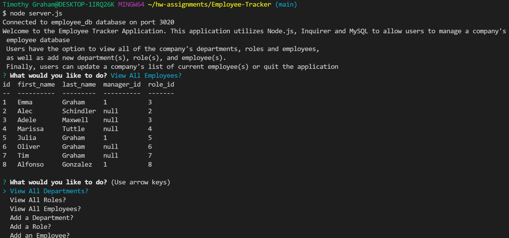

# Employee Tracker

## Description:
This is a command-line application that utilizes Node.js, Inquirer and MySQL to allow users to manage a company's employee database. Users have the option to view all of the company's departments, roles and employees, as well as add new department(s), role(s), and employee(s). Finally, users can update a company's list of current employee(s) or quit the application.

## Installation Instructions:
First, clone this repository. Navigate to the directory containing repository in your terminal. Open up the server.js file and enter in your MySQL credentials in lines 14-19. In your terminal, enter "npm install" to install all of the application's dependencies. If "npm install" does not work on its own, try to first enter "npm install mysql" followed by "npm install inquirer" followed by "npm install console.table." 

## Built With:
* Javascript
* [Node JS](https://nodejs.org/en/)
* [Inquirer NPM](https://www.npmjs.com/package//inquirer)
* [My SQL](https://www.npmjs.com/package/mysql)
* [Console.Table](https://www.npmjs.com/package/console.table)

## Deployed Links:
* [Link to GitHub Repo](https://github.com/egraham96/Employee-Tracker)

## Preview of Working Application:

[Video Showing How Application Can Be Used](https://watch.screencastify.com/v/HAsKHyfmMpqpEpCWhIte)

## How to Contribute:
If you'd like to contribute to this project please send an email to eeg4@uw.edu or message me on github: egraham96.

## License:

